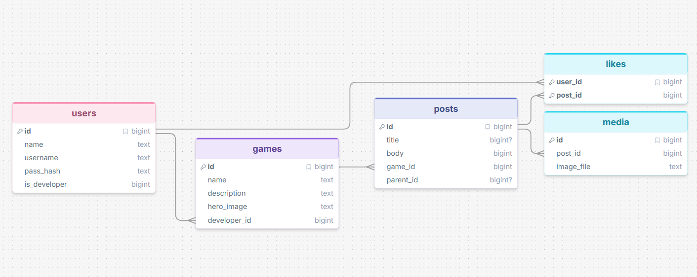

# Sprint 1 - Developing a DB and UI Prototype

## Sprint Goals

Develop a design for the database and a UI prototype that simulates the key functionality of the system. Test and refine the UI so that it can serve as the model for the next phase of development in Sprint 2.

### Specific Goals

**Edit these goals as needed**

- Design the database:
    - Tables
    - Fields / types
    - Primary keys
    - Default / nullable values
    - Relationships (foreign keys)
- Design the UI
    - Key pages
    - User interactions and 'flow'
    - Page layouts / features
    - Colour palette
    - Etc.

## Initial Database Design

This initial design allows user accounts, along with games, posts relating to a game or another post (replies), it also allows users to like posts and upload media to posts.

### Required Data Input

Users will have to log into accounts, so will need to input details like name, password and a username. User posts would require inputs with the text and title.Developers need more control over posts with other inputs like images. Developers will also have the ability to create a 'game' which is a dedicated page for a game the developers have released.

### Required Data Output

The system will display the contents of posts, text, images, date, ect. Game pages will show the details for the game, and usernames will be displayed on user created content (like posts)

### Required Data Processing

Posts will be formatted differently based on the data it contains, developer posts will have different content to user discussion posts, and replies will have different content still. By sorting the posts based on what they are, they can be displayed differently.

## UI 'Flow'

The first stage of prototyping was to explore how the UI might 'flow' between states, based on the required functionality.

This Penpot demo shows the initial design for the UI 'flow':

https://design.penpot.app/#/view?file-id=f0485fb1-4e63-8165-8008-3908a3fa80ef&page-id=f0485fb1-4e63-8165-8008-3908a3fa80f0&section=interactions&frame-id=bc4cea32-4b29-80f1-8008-3908aab33563&index=0&share-id=a234c67f-eb39-8116-8008-3f6d2606efee

### Testing

Replace this text with notes about what you did to test the UI flow and the outcome of the testing.

### Changes / Improvements

Replace this text with notes any improvements you made as a result of the testing.

*IMPROVED FIGMA FLOW - PLACE THE FIGMA EMBED CODE HERE - MAKE SURE IT IS SET SO THAT EVERYONE CAN ACCESS IT*

## Initial UI Prototype

The next stage of prototyping was to develop the layout for each screen of the UI.

This Figma demo shows the initial layout design for the UI:

*FIGMA PROTOTYPE - PLACE THE FIGMA EMBED CODE HERE - MAKE SURE IT IS SET SO THAT EVERYONE CAN ACCESS IT*

### Testing

Replace this text with notes about what you did to test the UI flow and the outcome of the testing.

### Changes / Improvements

Replace this text with notes any improvements you made as a result of the testing.

*FIGMA IMPROVED PROTOTYPE - PLACE THE FIGMA EMBED CODE HERE - MAKE SURE IT IS SET SO THAT EVERYONE CAN ACCESS IT*

## Refined UI Prototype

Having established the layout of the UI screens, the prototype was refined visually, in terms of colour, fonts, etc.

This Figma demo shows the UI with refinements applied:

*FIGMA REFINED PROTOTYPE - PLACE THE FIGMA EMBED CODE HERE - MAKE SURE IT IS SET SO THAT EVERYONE CAN ACCESS IT*

### Testing

Replace this text with notes about what you did to test the UI flow and the outcome of the testing.

### Changes / Improvements

Replace this text with notes any improvements you made as a result of the testing.

*FIGMA IMPROVED REFINED PROTOTYPE - PLACE THE FIGMA EMBED CODE HERE - MAKE SURE IT IS SET SO THAT EVERYONE CAN ACCESS IT*

## Sprint Review

Replace this text with a statement about how the sprint has moved the project forward - key success point, any things that didn't go so well, etc.

