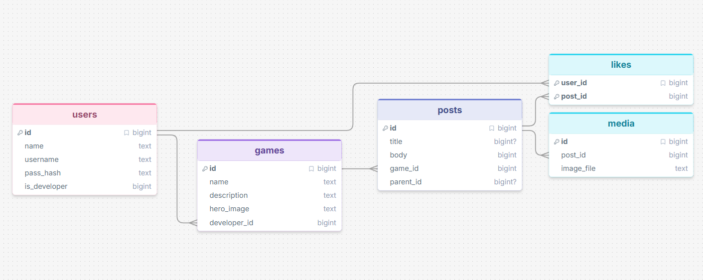
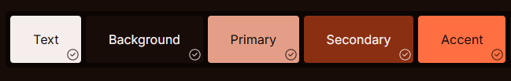
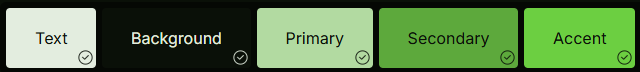
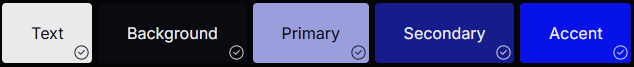
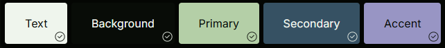
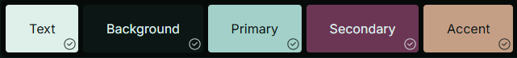
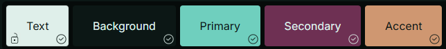

# Sprint 1 - Developing a DB and UI Prototype

## Sprint Goals

Develop a design for the database and a UI prototype that simulates the key functionality of the system. Test and refine the UI so that it can serve as the model for the next phase of development in Sprint 2.

### Specific Goals

**Edit these goals as needed**

- Design the database:
    - Tables
    - Fields / types
    - Primary keys
    - Default / nullable values
    - Relationships (foreign keys)
- Design the UI
    - Key pages
    - User interactions and 'flow'
    - Page layouts / features
    - Colour palette
    - Etc.

## Initial Database Design

This initial design allows user accounts, along with games, posts relating to a game or another post (replies), it also allows users to like posts and upload media to posts.

### Required Data Input

Users will have to log into accounts, so will need to input details like name, password and a username. User posts would require inputs with the text and title.Developers need more control over posts with other inputs like images. Developers will also have the ability to create a 'game' which is a dedicated page for a game the developers have released.

### Required Data Output

The system will display the contents of posts, text, images, date, ect. Game pages will show the details for the game, and usernames will be displayed on user created content (like posts)

### Required Data Processing

Posts will be formatted differently based on the data it contains, developer posts will have different content to user discussion posts, and replies will have different content still. By sorting the posts based on what they are, they can be displayed differently.

## UI 'Flow'

The first stage of prototyping was to explore how the UI might 'flow' between states, based on the required functionality.

This Penpot demo shows the initial design for the UI 'flow':

[Initial UI Flow - Penpot](https://design.penpot.app/#/view?file-id=f0485fb1-4e63-8165-8008-3908a3fa80ef&page-id=f0485fb1-4e63-8165-8008-3908a3fa80f0&section=interactions&frame-id=bc4cea32-4b29-80f1-8008-3908aab33563&index=0&share-id=a234c67f-eb39-8116-8008-3f6d2606efee)

### Testing

I tested the flow prototype with my end users, and got some feedback.

Two primary parts of the feedback I got was around the developer side of the site. A centralised way for developers to see/edit/create games and posts would allow for easier control and creation for the developers. The end user suggested I implement something like a developer dash board where they can access all the tools they may need. The other piece of feedback was about not being able to edit the details of a game page past creating it. Adding a way for developers to edit the game would be good just in case details do change over time.

### Changes / Improvements

The main things that were added were options to edit created content (games, posts). As well as this I added a developer dashboard where they can easily manage games and posts to help them get the most usability out of the app. These changes allow all users to have more control over their experience with the site and adds more options to fix any mistakes that were made. 

[Improved UI Flow - Penpot](https://design.penpot.app/#/view?file-id=a234c67f-eb39-8116-8008-3f6c0149b506&page-id=f0485fb1-4e63-8165-8008-3908a3fa80f0&section=interactions&frame-id=bc4cea32-4b29-80f1-8008-3908aab33563&index=0&share-id=20bdb21e-17d3-8193-8008-44702f118f80)

With this new design, the end users I tested with agreed that this was a better to use version of the UI. The changes made to navigating and using the functions of the site made it more robust for users, and especially developers with easy to access tools.

## Initial UI Prototype

The next stage of prototyping was to develop the layout for each screen of the UI.

This Figma demo shows the initial layout design for the UI:

[Initial UI Layout - Penpot](https://design.penpot.app/#/view?file-id=4ff7ff5f-2875-80f9-8008-5a7719c9c302&page-id=4ff7ff5f-2875-80f9-8008-5a7719c9c303&section=interactions&frame-id=de396a2f-6742-8072-8008-5a7730fc36d8&index=0&share-id=bd31e32d-d69f-81e2-8008-6379fba3fa40)

### Testing

I showed the prototype UI to my end users to get feedback and ways to improve the design further. The End User feedback only had some small changes to make the site better, as users were mostly happy with the site. One suggestion was to make users be able to create a more personalised profile to differentiate and let users express themselves more. They also suggested a way to create posts directly from the Game Page for ease of access.

### Changes / Improvements

I added more option for user customisation, as well as a profile page where users can change their details and update their profiles. I also added the ability for users to bookmark games, which appear on their profile so they can access them easily.
With the developer side, I added post creation into the Game page to allow easier creation from more than one place place.

[Refined UI Layout - Penpot](https://design.penpot.app/#/view?file-id=2be68822-842f-8175-8008-661e72e06d83&page-id=4ff7ff5f-2875-80f9-8008-5a7719c9c303&section=interactions&frame-id=de396a2f-6742-8072-8008-5a7730fc36d8&index=0&share-id=8694f143-a620-8054-8008-66391a71446e)

## Refined UI Prototype

Having established the layout of the UI screens, the prototype was refined visually, in terms of colour, fonts, etc.

This Figma demo shows the UI with refinements applied:

These are the 5 colour schemes I chose for the site, as each would fit with the kind of site it is. Each of them fit with the game development/gaming community aspect. All 5 of the colour schemes I chose also make sure to have passing accessibility contrast ratings, so that the colours and text will be easy to read and won't make the site confusing or hard to use.

End User feedback on this thought that the 2nd, 4th and 5th were the best options. The 5th option was chosen as the best, if I made the colours slightly more vibrant.

I updated the colour scheme and end users agreed this worked best. I then moved on to designing the UI of the app.

[Initial UI Design - Penpot](https://design.penpot.app/#/view?file-id=6f06cb60-262a-804c-8008-6c7fdb99375e&page-id=4ff7ff5f-2875-80f9-8008-5a7719c9c303&section=interactions&frame-id=de396a2f-6742-8072-8008-5a7730fc36d8&index=0&share-id=81f57451-85cc-819d-8008-757c7a6ac98e)

### Testing

Showing this design to End Users, they thought that overall it looked great, but there were a couple of spots they thought there was room for improvements. The 3 Nav Buttons have a bright blue background colour on a slightly off-white icon colour. This doesn't contrast very well which might make the buttons harder to understand for some users. They suggested either darkening the background, or changing the colour of the icons. Another point was in areas where user's names would be displayed, also showing their profile as a further identifier, which would allow users to more easily recognise other users, rather than just the username.

### Changes / Improvements

I created these two alternate Nav menu options that I showed to my end users, who agreed that the first option, with the dark icons worked better.

I also added user profile displays to comments, discussion posts ect. where other users would interact with eachother.

[Final UI Design - Penpot](https://design.penpot.app/#/view?file-id=81f57451-85cc-819d-8008-757d7d11345a&page-id=4ff7ff5f-2875-80f9-8008-5a7719c9c303&section=interactions&frame-id=de396a2f-6742-8072-8008-5a7730fc36d8&index=0&share-id=81f57451-85cc-819d-8008-758317e8a8f1)

The end users liked these changes, thinking the site was more accessible and user friendly with the darker icons, and also the profile pictures as further identifiers for users.

## Sprint Review

The design of my site is user friendly, allows easy navigation and use, along with contrasting colours and a clear, elegant UI Layout that will help a large variety of users to be able to effectively use the site for their needs. I, along with my end users, are happy with the outcome of the UI.

