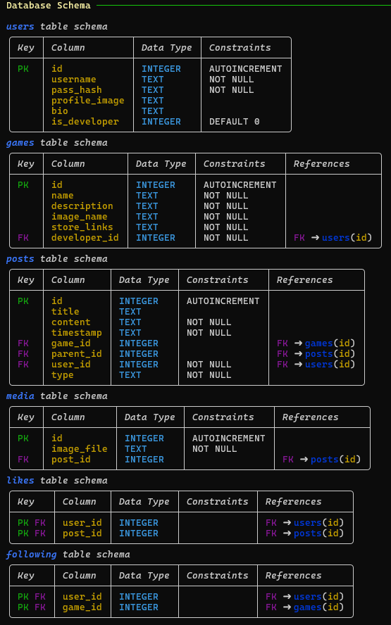
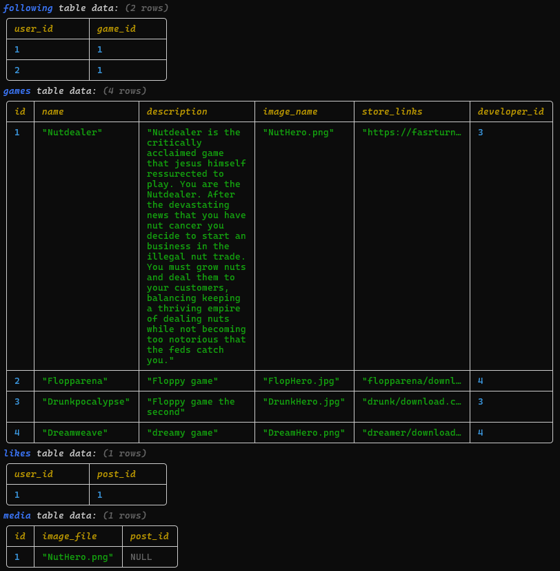
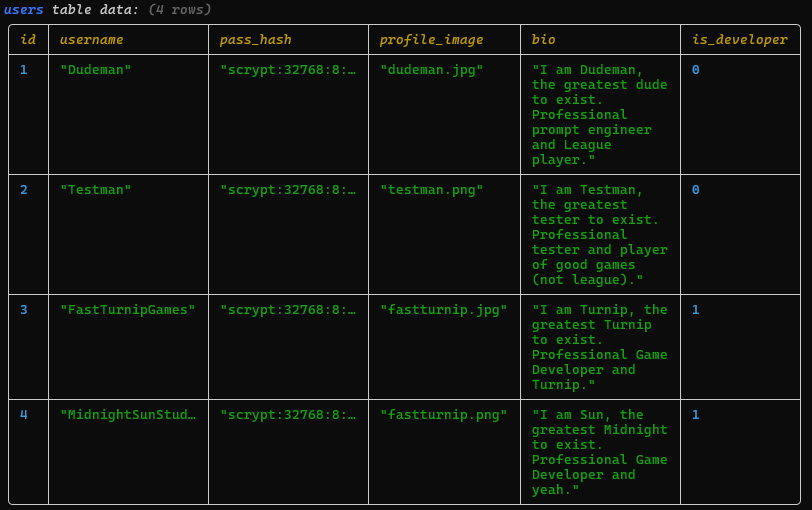
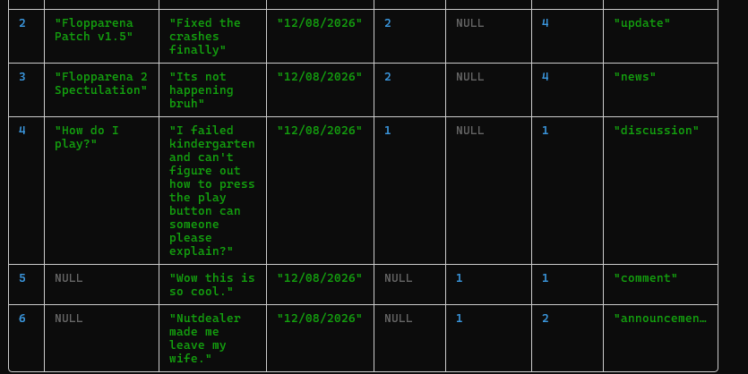
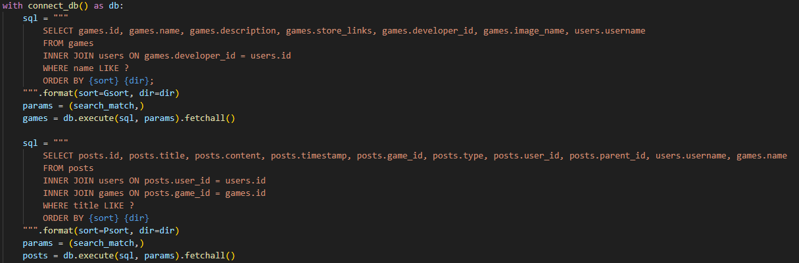
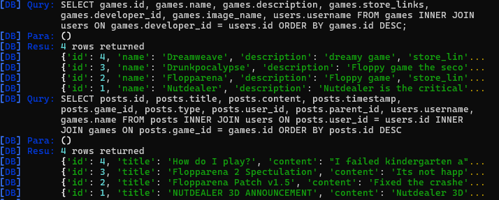
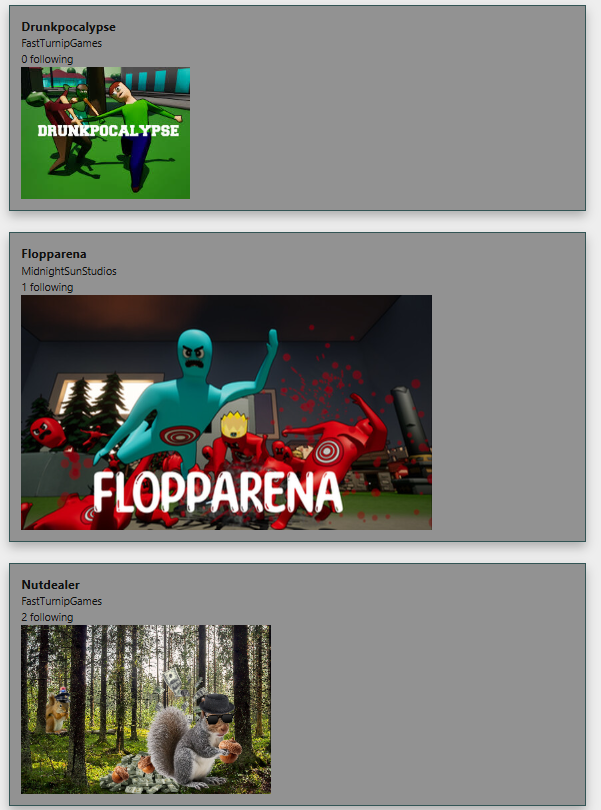
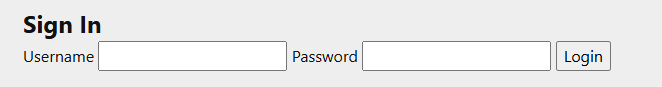
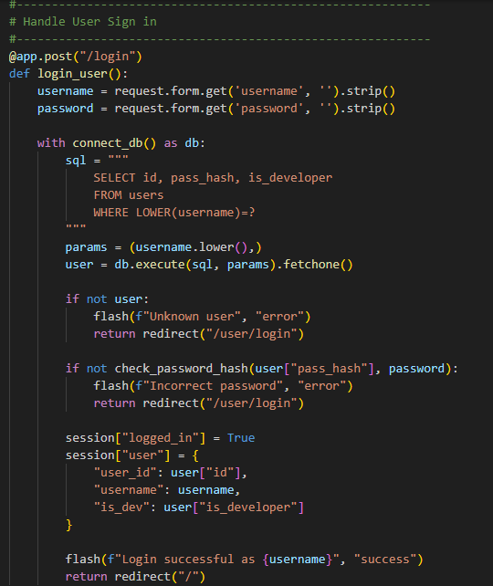
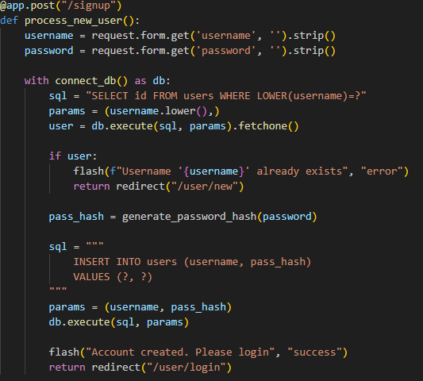

# Sprint 2 - Implement Database and Display of Test Data

## Sprint Goals

Implement the database, populated with test data. Create queries that retrieve test data, and display this on web pages as needed. Test and refine the queries and data display, so that it stands as the basis of the next sprint.

### Specific Goals

- Implement the database
- Add test data to the database
- Create the following web pages:
    - Home pages showing games and posts, with searching and sort functions.
    - Game pages with more details for the game as well as a display for all developer posts and a user discussion.
    - Post pages displaying all content and allowing users to comment and react.
    - Forms for creating/editing posts and games, along with login/signup pages.
    - Developer dashboard for easy creation and management.
    - User profiles
- Develop SQL database queries to:
    - Retrieve all games, posts and users needed
    - Retrieve specific posts for games, comments for posts users that have liked or commented ect.
    - Creating/updating/deleting entries into different tables (User, Posts, Games ect.)
    - Users liking posts, or following games.

## Testing Database Config

This test is to make sure the Database creates all required tables, along with the columns, data types and any constraints or keys/references between tables, as well as seeding tables with correct data.

Initially I tested the table creation before trying to seed any data.

### Changes / Improvements

The database is correctly creating all tables and entries, so next I set up some seed data for testing.

Note: Post table to large to fully show, so only showing some seed data entries.

The database builds correctly and also seeds data into each table for testing.

## Testing Database content display

This is to test that the application can connect to the database, and access data from it through SQL queries and then process them and display them.
For this test I will be displaying all games added to the games table, and all posts as well. It should display any information for each entry as well as linked data between tables.

The query is correctly collecting the data from posts and games.

### Changes / Improvements

The next step of this test was to get the data to display in the web app, using Jinja and HTML, I set up the begginings of the apps home page to test this.

Posts Displaying Correctly

Games Displaying Correctly

The web app is correctly displaying the data retrieved from the queries, as well as processing references between tables into displaying correctly, for example the game name on the posts, and the number of likes/followers.

## Testing User Inputs into database

For this test I will be setting up a login system to test sessions, and user inputs into database queries. I set up a simple login page with a form for Username and Password. 

When the user attempts to login the app queries the users input username to find matching data entries, which it then checks the password hash with to confirm the user login. If the passwords match it will save all user data into the session for later use. 

### Changes / Improvements

I then wanted to test creating entries in the Database, so created a sign up page to allow users to create accounts.

Instead of comparing passwords, it makes are an entry with the same username doesn't exist before inserting that data as a new entry. This works without errors, and creating a new account and signing up with it worked. 

## Testing Editing and Deleting Entries

### Changes / Improvements

## Sprint Review

The database for my webapp is working, along with seeded data to test with. My app is able to connect to the database and make queries, retrieving data, as well as adding, editing and deleting entries. This gives me the basis of my site to build off.

