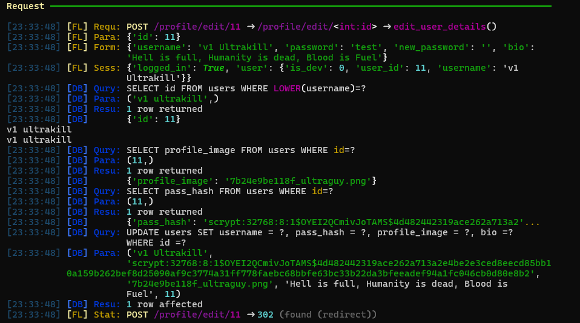
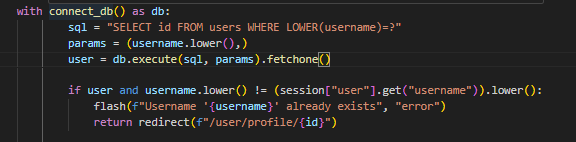
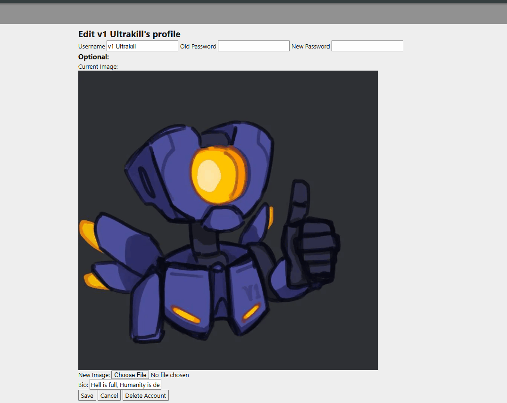
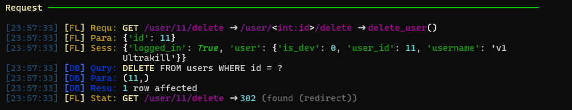
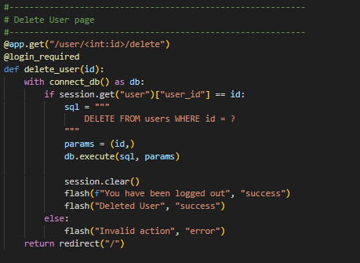

# Sprint 2 - Implement Database and Display of Test Data

## Sprint Goals

Implement the database, populated with test data. Create queries that retrieve test data, and display this on web pages as needed. Test and refine the queries and data display, so that it stands as the basis of the next sprint.

### Specific Goals

- Implement the database
- Add test data to the database
- Create the following web pages:
    - Home pages showing games and posts, with searching and sort functions.
    - Game pages with more details for the game as well as a display for all developer posts and a user discussion.
    - Post pages displaying all content and allowing users to comment and react.
    - Forms for creating/editing posts and games, along with login/signup pages.
    - Developer dashboard for easy creation and management.
    - User profiles
- Develop SQL database queries to:
    - Retrieve all games, posts and users needed
    - Retrieve specific posts for games, comments for posts users that have liked or commented ect.
    - Creating/updating/deleting entries into different tables (User, Posts, Games ect.)
    - Users liking posts, or following games.

## Testing Database Config

This test is to make sure the Database creates all required tables, along with the columns, data types and any constraints or keys/references between tables, as well as seeding tables with correct data.

Initially I tested the table creation before trying to seed any data.

### Changes / Improvements

The database is correctly creating all tables and entries, so next I set up some seed data for testing.

Note: Post table to large to fully show, so only showing some seed data entries.

The database builds correctly and also seeds data into each table for testing.

## Testing Database content display

This is to test that the application can connect to the database, and access data from it through SQL queries and then process them and display them.
For this test I will be displaying all games added to the games table, and all posts as well. It should display any information for each entry as well as linked data between tables.

The query is correctly collecting the data from posts and games.

### Changes / Improvements

The next step of this test was to get the data to display in the web app, using Jinja and HTML, I set up the begginings of the apps home page to test this.

Posts Displaying Correctly

Games Displaying Correctly

The web app is correctly displaying the data retrieved from the queries, as well as processing references between tables into displaying correctly, for example the game name on the posts, and the number of likes/followers.

## Testing User Inputs into database

For this test I will be setting up a login system to test sessions, and user inputs into database queries. I set up a simple login page with a form for Username and Password. 

When the user attempts to login the app queries the users input username to find matching data entries, which it then checks the password hash with to confirm the user login. If the passwords match it will save all user data into the session for later use. 

### Changes / Improvements

I then wanted to test creating entries in the Database, so created a sign up page to allow users to create accounts.

The sign up system will check through the database to see if there are already users with the same username, if none are found it will then create an entry into the users table with the new data. An end user suggested I route the sign up to the sign in page instead of home, to allow users to more easily create and log into their account.

## Testing Editing Entries
Users need to be able to change data that has been entered into the database, such as posts they have made or their account details. For this test I will be setting up a system for users to edit their profile details.

This system allows users to go to an edit page, where their current information is filled and they can update or change the details, the post route shows it retrieving the new values and inserting them into the database.
### Changes / Improvements
Through testing both by myself and with my end-users, some issues were found in the way the system handles the new information. If the username wasn't changed, the system could incorrectly search in the database and find a match thinking it is another user's username. To fix this I added a second rule after the database search to check the session off against the new username before it updates the database and session. 

Based on End-user feedback, I changed the way passwords were updated. Initially, you had to enter the old password only if you were setting a new one to compare it to, and end users suggested I made it required for the user password to be entered to confirm the user before allowing details to be changed. The new system checks the hash of the entered password with the database entry, if it matches it then checks if a new password has been set and then updates the database based off that.

## Testing Deleting Entries
The last way users will interact with the database is deleting entries, so to finish off the accounts system, I added a way to delete accounts.

It will find the user entry with the provided ID and them remove it if it exists and clear the session, returning users to the home page.

### Changes / Improvements
I made it so the route could only be accessed if the session was logged in, making sure there was a user to delete before it tried to remove the entry to avoid errors. For further security, end users said that there should be a check to make sure that the deleted user is the current session user, to stop people from being able to access and delete other users without being signed into them.

## Sprint Review

The database for my webapp is working, along with seeded data to test with. My app is able to connect to the database and make queries, retrieving data, as well as adding, editing and deleting entries. This gives me the basis of my site to build off and develop further functionality into the users and other systems related to the database.

